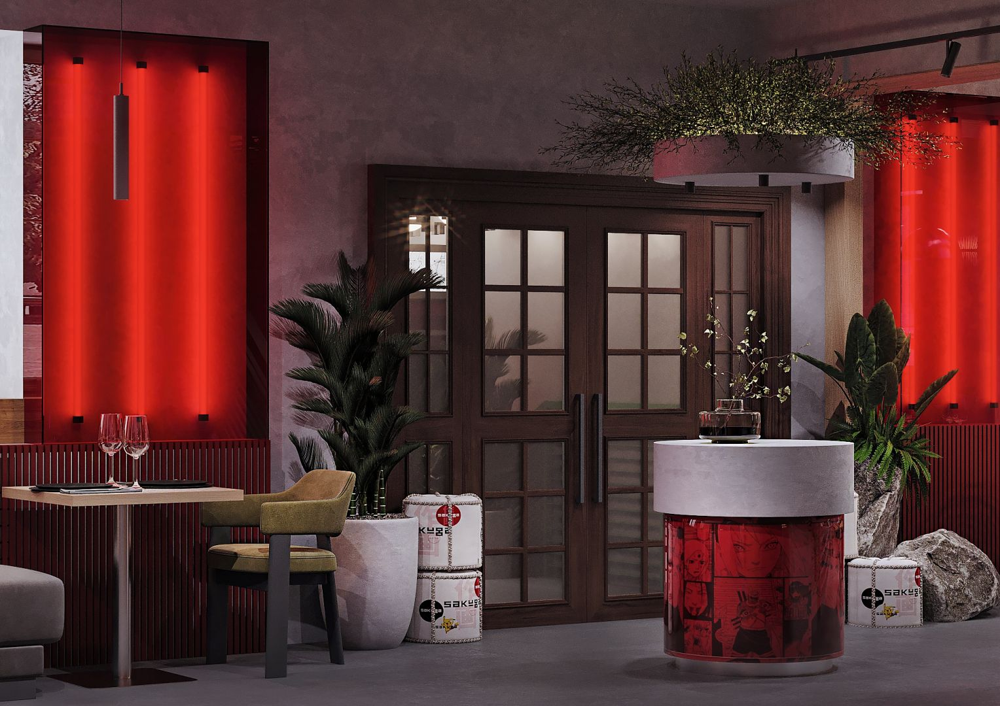

# 🎬 Руководство по медиа-файлам для сайта Sakuga

Этот документ содержит инструкции по добавлению видео, звуков и фотографий на сайт.

---

## 📁 Структура папок

```
assets/
├── video/           # Видео файлы для фона
├── sounds/          # Звуковые файлы
images/
├── downloaded/      # Реальные фотографии с сайта ресторана
├── menu/           # Фотографии блюд
├── drinks/         # Фотографии напитков
└── gallery/        # Фотографии для галереи
```

---

## 🎥 1. ВИДЕО ФОН (Hero Section)

### Что нужно:
Короткое видео атмосферы ресторана (10-30 секунд, зациклено)

### Где взять:
- Снять самостоятельно в ресторане (звук жарки, пар, свет, движение)
- Купить на стоках: Envato, Shutterstock, Adobe Stock
- Бесплатно: Pexels, Pixabay (ключевые слова: "asian restaurant", "cooking", "japanese kitchen")

### Как добавить:
1. Создайте папку `assets/video/`
2. Сохраните видео как `hero-background.mp4` и/или `hero-background.webm`
3. Рекомендуемые параметры:
   - Разрешение: 1920x1080 (Full HD) или выше
   - Формат: MP4 (H.264) и/или WebM
   - Длительность: 10-30 секунд
   - Размер файла: до 5 МБ (сжатое)
   - FPS: 24-30

### Пример команды для сжатия видео (FFmpeg):
```bash
ffmpeg -i input.mp4 -vcodec libx264 -crf 28 -preset slow -vf scale=1920:1080 -an hero-background.mp4
```

### ⚠️ Важно:
- Видео должно быть без звука (muted)
- Оптимизируйте размер файла для быстрой загрузки
- Если видео не загрузится, автоматически используется фоновое изображение

---

## 🎵 2. ЗВУК KOTO (Приветствие)

### Что нужно:
Короткий звук японского инструмента koto (1-3 секунды)

### Где взять:
- **Бесплатно**: Freesound.org (поиск: "koto", "japanese", "shamisen")
- **Платно**: AudioJungle, Epidemic Sound
- **YouTube Audio Library**: бесплатные звуки

### Рекомендованные звуки:
- Одна нота koto (приветственный звук)
- Короткая мелодия (2-3 секунды)
- Звук японского колокольчика

### Как добавить:
1. Создайте папку `assets/sounds/`
2. Сохраните звук как `koto-welcome.mp3` и/или `koto-welcome.ogg`
3. Рекомендуемые параметры:
   - Формат: MP3 и/или OGG
   - Длительность: 1-3 секунды
   - Битрейт: 128 kbps
   - Размер: до 100 КБ

### Примеры ссылок:
- https://freesound.org/search/?q=koto
- https://freesound.org/search/?q=japanese+bell

### ⚠️ Важно:
- Громкость автоматически установлена на 30% (тихий фон)
- Звук воспроизводится один раз при открытии сайта
- Если браузер блокирует автовоспроизведение, звук включится при первом клике

---

## 📸 3. ФОТОГРАФИИ С САЙТА РЕСТОРАНА

### Откуда брать:
**https://brandchef.ru/proekty/sakuga/**

### Как загрузить:
См. подробную инструкцию в файле: `images/downloaded/DOWNLOAD_INSTRUCTIONS.md`

### Краткая инструкция:
1. Откройте сайт https://brandchef.ru/proekty/sakuga/
2. Кликните правой кнопкой на фото → "Сохранить изображение как..."
3. Сохраните в `images/downloaded/`
4. Переименуйте файлы согласно списку:

**Основные файлы:**
- `sakuga-interior-1.jpg` - Главный фон (hero)
- `sakuga-interior-2.jpg` до `sakuga-interior-6.jpg` - Галерея
- `sakuga-dish-1.jpg` до `sakuga-dish-6.jpg` - Блюда
- `sakuga-drink-1.jpg` до `sakuga-drink-3.jpg` - Напитки

---

## 📋 4. ОБНОВЛЕНИЕ ПУТЕЙ К ИЗОБРАЖЕНИЯМ

### После загрузки фотографий обновите пути в файлах:

#### В `data/menu.json`:
```json
{
  "image": "images/downloaded/sakuga-dish-1.jpg"
}
```

#### В `data/drinks.json`:
```json
{
  "image": "images/downloaded/sakuga-drink-1.jpg"
}
```

#### Для галереи в `index.html`:
```html

```

---

## ✅ CHECKLIST перед запуском

### Видео:
- [ ] Видео добавлено в `assets/video/hero-background.mp4`
- [ ] Размер файла оптимизирован (< 5 МБ)
- [ ] Видео без звука
- [ ] Видео зациклено

### Звук:
- [ ] Звук koto добавлен в `assets/sounds/koto-welcome.mp3`
- [ ] Длительность 1-3 секунды
- [ ] Размер файла < 100 КБ

### Фотографии:
- [ ] Загружено минимум 20 фото с сайта ресторана
- [ ] Фото сохранены в `images/downloaded/`
- [ ] Файлы переименованы правильно
- [ ] Обновлены пути в `menu.json` и `drinks.json`

---

## 🚀 Быстрый старт

### Минимальный набор (чтобы сайт выглядел отлично):

1. **Фотографии (ОБЯЗАТЕЛЬНО)**:
   - 1 фото для hero-фона
   - 6 фото блюд для меню
   - 3 фото напитков
   - 6 фото интерьера для галереи

2. **Видео (ОПЦИОНАЛЬНО)**:
   - Можно добавить позже
   - Без видео используется фоновое изображение

3. **Звук (ОПЦИОНАЛЬНО)**:
   - Приятное дополнение
   - Можно добавить позже

---

## 💡 Рекомендации

### Производительность:
- Сжимайте изображения (TinyPNG, ImageOptim)
- Используйте WebP формат для лучшего сжатия
- Lazy loading включен автоматически

### Качество:
- Используйте только качественные фото
- Все фото должны быть в одном стиле
- Профессиональная фотосъемка повышает конверсию на 40%

### SEO:
- Добавляйте alt-тексты к изображениям
- Используйте описательные названия файлов
- Оптимизируйте размер файлов

---

## 🆘 Проблемы и решения

### Видео не воспроизводится:
- Проверьте формат (должен быть MP4 или WebM)
- Проверьте путь к файлу
- Откройте консоль браузера (F12) для ошибок

### Звук не воспроизводится:
- Многие браузеры блокируют автовоспроизведение
- Звук включится при первом клике пользователя
- Проверьте формат (MP3 или OGG)

### Фотографии не отображаются:
- Проверьте правильность путей
- Проверьте названия файлов (регистр важен!)
- Очистите кэш браузера (Ctrl+F5)

---

**Готово! Теперь у вас есть всё необходимое для добавления медиа на сайт!** 🎉
